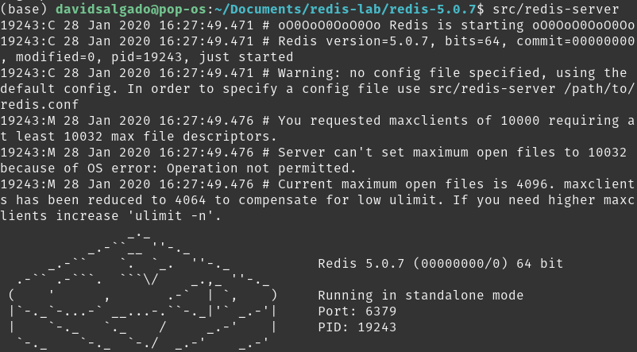
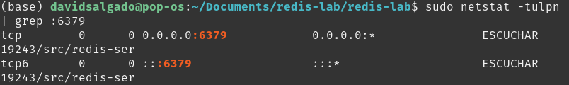

# RU102J

## Environment Setup

### Redis Lab

### On Premise (Docker)

### On Premise (Local Machine)
#### Redis Server Installation
Download the latest stable source from the [original page](https://redis.io/download) with the follows steps:

```bash
$ wget http://download.redis.io/releases/redis-5.0.7.tar.gz
$ tar xzf redis-5.0.7.tar.gz
$ cd redis-5.0.7
$ make
$ make test
```
Once the tests are successfully completed, you can run the redis server:

```bash
$ src/redis-server
```



If you are receiving an address already in use error message when trying run the redis server, means that there is already running process at 6379 port (e.g a previous running redis instance. Remember that 6379 port is the default redis server port). This may be because you installed redis through the OS package manager. You can verify the process that this port is using through the following line:

```bash
$ sudo netstat -tulpn | grep :6379
```




